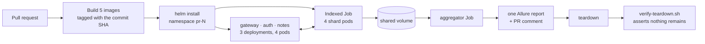

<div align="center">

# Ephemeral Kubernetes test environments

**Every pull request gets its own Kubernetes namespace. The API suite runs sharded
across parallel Jobs inside it. The results become one report.
Then the namespace is destroyed — and the pipeline proves it.**

[](https://github.com/AKogut/ephemeral-k8s-test-envs/actions/workflows/ci.yml)
[](LICENSE)
[](https://kubernetes.io/)
[](https://helm.sh/)
[](https://playwright.dev/)
[](https://nodejs.org/)

[Quick start](#quick-start) · [How it works](#what-actually-happens) ·
[Docs](docs/) · [Wiki](https://github.com/AKogut/ephemeral-k8s-test-envs/wiki) ·
[Board](https://github.com/users/AKogut/projects/18)

</div>

---

No shared staging environment to queue for. No "it passed on staging" where staging
was in an unknown state. No leftover namespaces quietly costing money after the PR
is merged.

## Quick start

```bash
git clone https://github.com/AKogut/ephemeral-k8s-test-envs.git
cd ephemeral-k8s-test-envs
./scripts/local-demo.sh
```

A `kind` cluster, five images, a namespace, 105 tests across 4 parallel pods, an
aggregated report, and a verified teardown. **No cloud account, roughly three
minutes.** Needs `docker`, `kind`, `kubectl` and `helm`.

## What actually happens



Output from a real CI run — this is the comment posted on the pull request:

```
## ✅ All tests passed

**Environment:** `pr-54`   **Shards:** `4`

| Total | Passed | Failed | Broken | Skipped | Flaky | Retries |
|------:|-------:|-------:|-------:|--------:|------:|--------:|
| 105   | 105    | 0      | 0      | 0       | 0     | 0       |

### Sharding
Ran on 4 parallel shard(s).
Sequential cost would have been 20.4s; the run took 6.4s
— a 3.19× speedup (79.7% shard efficiency).

| Shard | Tests | Passed | Failed | Duration |
|------:|------:|-------:|-------:|---------:|
| 0     | 13    | 13     | 0      | 3.5s     |
| 1     | 31    | 31     | 0      | 5.1s     |
| 2     | 27    | 27     | 0      | 5.4s     |
| 3     | 34    | 34     | 0      | 6.4s     |
```

…and the step that makes "ephemeral" a tested property rather than a claim:

```
==> Verifying teardown of namespace pr-54
    ✓ namespace 'pr-54' does not exist
    ✓ no leftover clusterroles
    ✓ no leftover clusterrolebindings
    ✓ no orphaned PersistentVolumes
    ✓ no helm release record
✓ Teardown verified: nothing from this environment remains.
```

---

## The three ideas worth looking at

### 1. Sharding at the infrastructure level, not with a flag

`--workers=4` is one pod with four processes, bounded by that pod's CPU limit.
This is **four pods**, scheduled independently, using `completionMode: Indexed`:

```yaml
completionMode: Indexed
completions: 4      # done when indexes 0,1,2,3 have all succeeded
parallelism: 4      # …and they may all run at once
```

Kubernetes injects a distinct `JOB_COMPLETION_INDEX` into each pod. That single
variable is the **only** difference between them. Each pod independently
recomputes the same deterministic plan and takes its own slice:

```
JOB_COMPLETION_INDEX=2 ──► shard-tests --index 2 --total 4 ──► playwright test <its files>
```

**No queue, no broker, no leader.** Nothing is negotiated at runtime, so nothing
can deadlock or double-assign. A pod rescheduled onto another node recomputes
exactly the slice its predecessor had.

The split is **LPT greedy bin-packing weighted by historical duration**, not a
round-robin by file count — because a run is only as fast as its slowest shard:

```
$ npm run shard:plan

Shard plan: 11 files across 4 shards
Ideal weight per shard: 12.22 | makespan: 12.50 | balance: 97.8%

  shard 0: 2 file(s), weight 11.90     ← two files, not three
      - auth-me.spec.ts
      - user-journey.spec.ts           ← the 9.5s file gets a shard nearly to itself
  shard 1: 3 file(s), weight 12.50
  shard 2: 3 file(s), weight 12.40
  shard 3: 3 file(s), weight 12.10
```

97.8% of a perfect split. Assigning files to minimise the slowest shard is
multiway number partitioning — NP-hard — and LPT is guaranteed within
4/3 − 1/(3k) of optimal. **The unit tests assert that bound directly**, along with
completeness, determinism across input permutations, and that the plan beats
round-robin when one file dominates.

→ [docs/sharding-strategy.md](docs/sharding-strategy.md)

### 2. Teardown is a first-class, tested step

Three independent layers, because no single one covers every failure:

| Layer | Mechanism | Covers |
|---|---|---|
| 1 | `ttlSecondsAfterFinished` on every Job | Finished pods, always |
| 2 | `helm uninstall` + `kubectl delete namespace`, `if: always()` | Failed deploys, failed tests, failed aggregation |
| 3 | A self-destruct Job that deletes its own namespace | **A cancelled workflow or a dead runner** — when CI never runs again |

Layer 3 is the one most setups skip, and the one that matters when a run is
cancelled mid-flight — because a cancelled job does not run its `if: always()`
steps to completion. Its RBAC is pinned to a single namespace:

```yaml
rules:
  - apiGroups: [""]
    resources: ["namespaces"]
    verbs: ["get", "delete"]
    resourceNames: [pr-123]     # this namespace and no other
```

Then `verify-teardown.sh` checks four things and **fails the build** if any
survive — including the three that a namespace deletion does *not* clean up:
cluster-scoped RBAC, released PersistentVolumes, and the Helm release record.
Those are exactly how a cluster fills with junk while everyone believes cleanup
is working.

→ [docs/cost-and-cleanup.md](docs/cost-and-cleanup.md)

### 3. Images built for the job they actually do

Every image is a three-stage build. The compiler, the type definitions and the
native toolchain for `better-sqlite3` all stay in the discarded stages.

| Image | Naive single-stage (`node:22`) | This repo (`node:22-slim`, 3-stage) | Reduction |
|---|---:|---:|---:|
| `auth-service` | 1.71 GB | **378 MB** | **78%** |
| `gateway` | 1.67 GB | **351 MB** | **79%** |
| `notes-service` | — | 378 MB | |
| `api-tests` | — | 404 MB | |
| `aggregator` | — | 346 MB | |

<sub>Uncompressed image size as reported by <code>docker images</code>. Both
columns use the same measurement, so the comparison is like-for-like.</sub>

None of the runtime images carries a package manager — every entrypoint is
`node`, so npm and corepack are deleted from the final layer. That does not save
a byte (the files live in the base layer; a later `rm` only writes a whiteout)
but it is what takes the last fixable critical out of every scan, because npm
vendors its own copy of `node-tar`.

The test runner deserves its own note. The documented base for a Playwright suite
is `mcr.microsoft.com/playwright` — **923 MB compressed**, because it ships
Chromium, Firefox and WebKit. This suite never opens a browser; it speaks HTTP
through Playwright's `request` fixture. So the runner is built on `node:22-slim`
(**79 MB compressed**) with `PLAYWRIGHT_SKIP_BROWSER_DOWNLOAD=1`, and CI fails if
browsers ever creep back in. That saving is multiplied by the shard count on every
run.

→ [ADR 0002](docs/adr/0002-browserless-test-runner-image.md)

---

## The application under test

Purpose-built and deliberately small. It exists to make a multi-pod namespace and
a genuine service-to-service call *necessary* rather than decorative.

| Service | Role | Endpoints |
|---|---|---|
| `gateway` | Reverse proxy, request-id propagation | `/auth/*` → auth, `/notes/*` → notes |
| `auth-service` | JWT issuer, SQLite, scrypt via `node:crypto` | `POST /register`, `POST /login`, `GET /me` |
| `notes-service` | Notes CRUD, per-owner scoping, SQLite | `GET/POST/PUT/PATCH/DELETE /notes`, `/notes/stats` |

`notes-service` **could** verify JWTs entirely locally — it shares the signing
secret. It is configured not to. With `authMode: verify-with-auth-service`, the
first use of each token triggers a real `GET /me` across cluster DNS, so the
deployment exercises service discovery, a bounded verification cache, and a
readiness gate that returns **503, not 401**, when the upstream is unreachable —
because "I cannot tell" is not "you are unauthorised".

### The suite

105 black-box API tests across 11 spec files:

```ts
test("hides another user's note behind a 404, not a 403", async ({ authed, authedAsOther }) => {
  const note = await createNote(authed, { title: 'Private' });
  const response = await authedAsOther.get(`/notes/${note.id}`);

  // 403 would confirm the id exists and turn the API into an id oracle.
  expect(response.status()).toBe(404);
});
```

Four pods hit **one** database, so isolation cannot come from resetting state
between tests — two pods would race. Every test provisions its own user and relies
on the service's own tenancy scoping, which means the multi-tenant path is
exercised on every run rather than in one dedicated test.

**Two bugs the suite caught while it was being written**, both now
regression-tested:

- `PATCH /notes/:id` silently wiped `body` and `tags`. Zod's `.partial()` makes
  keys optional but **keeps the `.default()` wrappers**, so an absent field still
  resolved to its default. PUT wants that; PATCH must not.
- Searching for `100%` returned nothing. The `%` was escaped with a backslash, but
  **SQLite ignores backslash escapes in `LIKE` unless `ESCAPE` is declared** — so
  the escaping was inert and the filter matched nothing.

---

## Repository layout

```
app/
  auth-service/     JWT issuer — Express + SQLite + scrypt
  notes-service/    Notes CRUD — per-owner scoping, upstream token verification
  gateway/          Reverse proxy — hand-rolled on fetch, zero proxy dependencies
tests/api/          105 Playwright API tests + the shard entrypoint
scripts/            shard planner · result merge · in-cluster k8s client (90 unit tests)
                    local-demo.sh · fetch-results.sh · verify-teardown.sh
charts/test-env/    The Helm chart — one isolated environment per release
docs/               architecture · sharding · cost-and-cleanup · ci-pipeline · 6 ADRs
.github/workflows/  One workflow: verify → build → deploy → shard → aggregate → destroy
```

## Commands

```bash
./scripts/local-demo.sh              # the full lifecycle on kind
./scripts/local-demo.sh --keep       # …but leave it running
./scripts/local-demo.sh --shards 8   # …with 8 shards
./scripts/local-demo.sh --no-tests   # just the environment

npm run test:unit                    # 90 unit tests, no cluster needed
npm run shard:plan                   # print the plan the pods will compute
npm run lint                         # ESLint, type-aware, all five packages
npm run typecheck                    # tsc across all five packages
npm run helm:lint                    # lint the chart with both value sets

npm run compose:up                   # the app under docker compose
npm run compose:test                 # the suite against it
```

## How it was built

Planned as **6 epics and 42 tasks**, delivered one pull request per phase. Each PR
is self-contained, verified on a real cluster before merging, and closes its
issues.

| Phase | Epic | Delivered in | What |
|---|---|---|---|
| 0 | [#1](https://github.com/AKogut/ephemeral-k8s-test-envs/issues/1) | [#49](https://github.com/AKogut/ephemeral-k8s-test-envs/pull/49) | Three containerised services |
| 1 | [#2](https://github.com/AKogut/ephemeral-k8s-test-envs/issues/2) | [#50](https://github.com/AKogut/ephemeral-k8s-test-envs/pull/50) | A Helm chart that stands up one isolated environment |
| 2 | [#3](https://github.com/AKogut/ephemeral-k8s-test-envs/issues/3) | [#51](https://github.com/AKogut/ephemeral-k8s-test-envs/pull/51) | The suite sharded across parallel Kubernetes Jobs |
| 3 | [#4](https://github.com/AKogut/ephemeral-k8s-test-envs/issues/4) | [#52](https://github.com/AKogut/ephemeral-k8s-test-envs/pull/52) | Per-shard results merged into one report |
| 4 | [#5](https://github.com/AKogut/ephemeral-k8s-test-envs/issues/5) | [#53](https://github.com/AKogut/ephemeral-k8s-test-envs/pull/53) | Teardown guarantees, and a step that proves them |
| 5 | [#6](https://github.com/AKogut/ephemeral-k8s-test-envs/issues/6) | [#54](https://github.com/AKogut/ephemeral-k8s-test-envs/pull/54) | The end-to-end CI pipeline, docs and wiki |

`main` is protected: pull request required, every check green, linear history, no
force pushes, no deletions. Board:
[Ephemeral K8s test environments](https://github.com/users/AKogut/projects/18).

## Documentation

| Document | What it covers |
|---|---|
| [Architecture](docs/architecture.md) | Components, request path, result storage, security posture |
| [Sharding strategy](docs/sharding-strategy.md) | LPT bin-packing, determinism, isolation across pods |
| [Cost and cleanup](docs/cost-and-cleanup.md) | The three teardown layers and what each one misses |
| [CI pipeline](docs/ci-pipeline.md) | The workflow, step by step |
| [Local development](docs/local-development.md) | Three ways to run it; full config reference |
| [ADRs](docs/adr/) | The six decisions worth arguing about |

Runbooks, an FAQ and longer-form background live in the
[wiki](https://github.com/AKogut/ephemeral-k8s-test-envs/wiki).

## What is deliberately not here

Scope discipline is part of the design, so the omissions are argued rather than
overlooked:

- **No custom CRD or operator.** Jobs, a TTL and a self-destruct Job are enough;
  an operator would be infrastructure to build and operate for no added guarantee.
- **No JWKS.** Shared-secret HS256, because the property being demonstrated — one
  service validating another's tokens — survives the simplification.
  → [ADR 0003](docs/adr/0003-shared-secret-jwt.md)
- **No Postgres.** SQLite on an `emptyDir` is a real database with nothing to
  operate — at the cost of single-replica data services, stated rather than hidden.
  → [ADR 0006](docs/adr/0006-single-replica-data-services.md)
- **No in-cluster Allure rendering.** That needs a JRE, which would triple the
  aggregator image to produce HTML that immediately leaves the cluster.
  → [ADR 0004](docs/adr/0004-aggregate-in-cluster-render-in-ci.md)
- **No cloud deployment.** The design has no provider lock-in; what changing to
  EKS/GKE would involve is tabulated in
  [architecture.md](docs/architecture.md#what-a-cloud-deployment-would-change).

## Contributing

See [CONTRIBUTING.md](CONTRIBUTING.md) for the development loops and conventions.
Security notes and the deliberate trade-offs are in [SECURITY.md](SECURITY.md).

## License

MIT — see [LICENSE](LICENSE).
