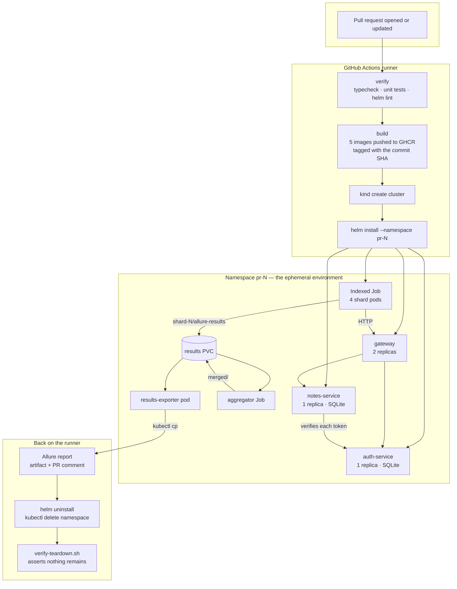

# Architecture

## The problem this solves

A single shared staging environment is a queue. Two people cannot test conflicting
changes at the same time, a bad deploy blocks everyone, and "it passed on staging"
means "it passed against whatever state staging happened to be in".

The alternative is an environment per change: created when a pull request opens,
destroyed when the run finishes, identical in shape to every other environment,
and cheap enough that nobody thinks twice about creating one. That is what this
repository builds.

The interesting engineering is not the application. It is everything around it:
how an environment is described so it can be created N times over, how a test
suite is split across pods without a coordinator, how results from those pods
become one report, and how the whole thing is guaranteed to disappear.

## The whole pipeline



## Components

| Component | Language | Role | Replicas |
|---|---|---|---|
| `gateway` | TypeScript / Express | Reverse proxy. `/auth/*` → auth-service, `/notes/*` → notes-service. Propagates `x-request-id`. | 2 |
| `auth-service` | TypeScript / Express + SQLite | Registration, login, JWT issuance, `GET /me`. | 1 |
| `notes-service` | TypeScript / Express + SQLite | Notes CRUD, per-owner scoping. Verifies tokens with auth-service. | 1 |
| `api-tests` | Playwright | 105 black-box API tests. One image, run as N shard pods. | N (default 4) |
| `aggregator` | TypeScript | Waits for the shard Job, merges results, writes the summary. Also hosts self-destruct. | 1 |

The application is deliberately small. It exists to make a multi-pod namespace and
a real service-to-service call *necessary* rather than decorative — three pods that
never talk to each other would not test anything a single pod could not.

## Why there is a service-to-service hop

`notes-service` could verify a JWT entirely on its own: it shares the signing
secret, so the signature check is local and fast. It is configured not to.

With `authMode: verify-with-auth-service` (the chart default), the first use of
each token triggers a `GET /me` against auth-service over cluster DNS. That makes
the deployment exercise things a single-service demo never would:

- cluster DNS resolution between two Services
- a readiness gate that actually matters — notes-service returns `503`, not `401`,
  when auth-service is unreachable, because "I cannot tell" is not "you are
  unauthorised"
- a timeout and a bounded cache, so a suite of 105 tests does not turn
  auth-service into the bottleneck

Set `notes.authMode=jwt-only` to skip the hop. The suite passes either way; only
the shape of the deployment changes.

## Request path

```
client ──► gateway :3000 ──┬──► auth-service  :3001 ──► SQLite (emptyDir)
                           │
                           └──► notes-service :3002 ──► SQLite (emptyDir)
                                       │
                                       └──► auth-service /me   (token verification)
```

Every response carries three headers that make a failure traceable:

| Header | Meaning |
|---|---|
| `x-request-id` | Adopted from the caller or generated. One id spans all three services. |
| `x-env-id` | Which ephemeral environment answered (`pr-123`). |
| `x-served-by` / `x-upstream` / `x-gateway` | Which service actually handled the request, and how it got there. |

When shard 3 reports a failure in a PR environment, those headers plus the JSON
logs are enough to find the exact request in the exact pod.

## Result storage

Shard pods write to a shared `PersistentVolumeClaim`:

```
/results/
  shard-0/allure-results/*.json   shard-0/shard-info.json
  shard-1/allure-results/*.json   shard-1/shard-info.json
  …
  merged/allure-results/          merged/summary.json   merged/summary.md
```

**The access mode is the constraint worth understanding.** The chart defaults to
`ReadWriteOnce`, which permits multiple pods only when they are scheduled on the
same node. That is always true on `kind` and `minikube` (one node), and it keeps
the local demo free of any storage add-on.

On a real multi-node cluster, one of these is needed instead:

| Option | Change | Trade-off |
|---|---|---|
| `ReadWriteMany` volume | `--set tests.results.accessMode=ReadWriteMany --set tests.results.storageClass=nfs` | Simplest; needs a storage class that supports RWX (EFS, Filestore, NFS, Longhorn). |
| Pin shards to one node | Add `tests.affinity` | Keeps RWO but throws away multi-node parallelism. |
| Object storage (MinIO / S3) | Shards `PUT` results, aggregator `GET`s them | No shared-volume constraint at all, works across clusters. Costs a MinIO deployment or a bucket. |

Object storage is the right answer at real scale, and the aggregator's input is
already a directory-per-shard abstraction, so swapping the transport touches
`aggregate-results.ts` and two templates. It is left out on purpose: this project
is meant to run end to end on a laptop with no cloud account.

## Ordering between Jobs

Kubernetes has no dependency edge between Jobs. Three options exist and the chart
uses the third:

1. **Helm hooks with weights** — couples ordering to Helm, so `kubectl apply` and
   `docker compose` paths behave differently.
2. **CI polls, then applies the aggregator** — puts the orchestration in the
   pipeline, so the chart alone cannot produce a report.
3. **An initContainer that blocks** — the aggregator pod starts immediately and
   its first container refuses to finish until the shard Job reaches a terminal
   state. Ordering lives in the chart, and `helm install` alone produces a report.

The wait polls the `batch/v1` API with the pod's own service account
([`k8s.ts`](../scripts/src/k8s.ts)) instead of shelling out to a `kubectl` image —
one less image to pull, pin and patch. It waits for *terminal*, not for *success*:
a run where two shards failed still has results worth merging.

## Security posture

Not because a notes API needs it, but because these are the defaults a reviewer
should see in any Kubernetes work:

- **Non-root everywhere.** `runAsNonRoot: true`, uid 1000, `fsGroup` set so mounted
  volumes are writable without root.
- **Read-only root filesystem** on every container. Anything that needs to write
  gets an explicit `emptyDir` — which is why `/tmp` is mounted and why the shard
  runner invokes the Playwright binary directly instead of through `npx`.
- **All capabilities dropped**, `allowPrivilegeEscalation: false`,
  `seccompProfile: RuntimeDefault`.
- **No service account token in application pods.** A proxy and two CRUD services
  have no business holding a cluster credential, so `automountServiceAccountToken`
  is `false` for all of them.
- **Least-privilege RBAC for the two workloads that do need the API.** The
  aggregator may `get` exactly one named Job. The teardown Job may `delete`
  exactly one namespace, pinned by `resourceNames`.
- **A JWT secret that survives upgrades.** The chart generates one per release and
  reuses the stored value on `helm upgrade`, so redeploying a PR environment does
  not invalidate tokens mid-run.

`networkPolicy.enabled` ships a default-deny plus the four flows the stack needs.
It is off by default because kind's CNI does not enforce NetworkPolicy — shipping
it enabled there would look like isolation while enforcing nothing.

## Image sizes

Every image is a three-stage build: dependencies, compile, runtime. The compiler,
type definitions and the native toolchain for `better-sqlite3` stay in the
discarded stages.

Measured with `docker image inspect --format '{{.Size}}'`; regenerate with
`make image-sizes` or the `Record image size` step in CI.

| Image | Single-stage (`node:22`) | Multi-stage (`node:22-slim`) | Reduction |
|---|---:|---:|---:|
| `auth-service` | see CI summary | see CI summary | — |
| `notes-service` | | | |
| `gateway` | | | |
| `api-tests` | | | |
| `aggregator` | | | |

> The table is filled in from a real run rather than from estimates — see
> [Image sizes](../README.md#image-sizes) in the README for the current numbers.

The `api-tests` image deserves a note of its own. The obvious base for a
Playwright suite is `mcr.microsoft.com/playwright`, which ships Chromium, Firefox,
WebKit and their system libraries. This suite never opens a browser — it speaks
HTTP through Playwright's `request` fixture — so it is built on `node:22-slim`
with `PLAYWRIGHT_SKIP_BROWSER_DOWNLOAD=1`. Four shard pods pulling that image on a
cold node is the difference between seconds and minutes.

## What a cloud deployment would change

The design has no cloud-provider dependency, but moving off `kind` changes four
things:

| Concern | On kind | On EKS / GKE / AKS |
|---|---|---|
| Cluster | Created and destroyed per run | Long-lived; the *namespace* is the ephemeral unit |
| Images | `kind load docker-image` | Pulled from a registry; needs `imagePullSecrets` or IRDS/Workload Identity |
| Result volume | RWO local-path | RWX (EFS/Filestore) or object storage |
| Ingress | `kubectl port-forward` | An Ingress or Gateway API route per namespace, `pr-123.preview.example.com` |
| Cleanup | `kind delete cluster` removes everything | The namespace TTL becomes load-bearing — see [cost-and-cleanup.md](cost-and-cleanup.md) |

The last row is the one that matters commercially. On a laptop, a leaked namespace
costs nothing. On a cloud cluster it costs money every hour until someone notices.

## Further reading

- [Sharding strategy](sharding-strategy.md) — why LPT bin-packing rather than `--shard=i/n`
- [Cost and cleanup](cost-and-cleanup.md) — the teardown guarantees, stated precisely
- [CI pipeline](ci-pipeline.md) — a step-by-step walk through the workflow
- [Local development](local-development.md) — running everything without a cluster
- [Architecture decisions](adr/) — the six decisions worth arguing about
