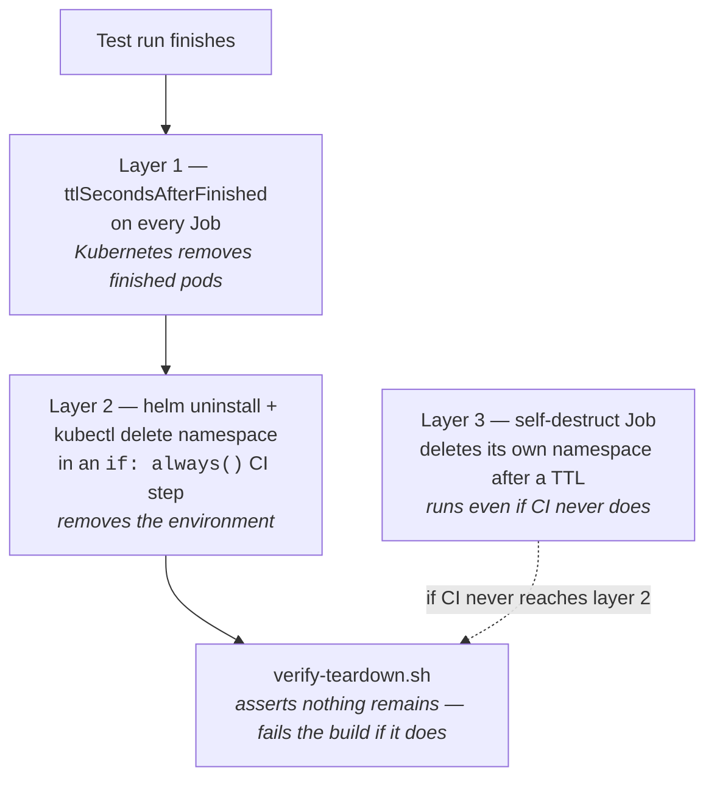

# Cost and cleanup

Ephemeral environments are easy to create and easy to forget. A namespace that
outlives its pull request costs money every hour on a cloud cluster and quota on
every cluster. This document states exactly what guarantees exist, what they do
*not* cover, and how the claim is proven rather than asserted.

## The claim

> After a run finishes — for any reason, including failure and cancellation —
> nothing created by that run remains in the cluster.

Every word of that is tested. The last step of a CI run is not "deploy succeeded",
it is `verify-teardown.sh` asserting the namespace is gone.

## Three independent layers

No single mechanism covers every failure mode, so there are three, each catching
what the previous one misses.



### Layer 1 — `ttlSecondsAfterFinished`

Every Job in the chart sets it (900s by default, 600s in CI):

```yaml
ttlSecondsAfterFinished: {{ .Values.tests.ttlSecondsAfterFinished }}
activeDeadlineSeconds: {{ .Values.tests.activeDeadlineSeconds }}
```

The TTL controller deletes the Job and its pods once they finish. `activeDeadlineSeconds`
covers the opposite case: a suite that hangs is killed rather than holding the
namespace open indefinitely.

**What this does not cover:** the Deployments, the Service, the PVC, the namespace.
A TTL on Jobs is pod hygiene, not environment cleanup. Relying on it alone is the
most common way a "self-cleaning" setup quietly leaks.

### Layer 2 — explicit teardown in the pipeline

The primary mechanism, and the one that runs in the normal case:

```yaml
- name: Tear down the environment
  if: always() && !inputs.keep_environment
  run: |
    helm uninstall "$release" -n "$ns" --wait --timeout 3m || true
    kubectl delete namespace "$ns" --wait=true --timeout=5m || true
```

Two details matter more than they look:

- **`if: always()`** — the step runs after a failed deploy, a failed test run, a
  failed aggregation. Teardown gated on success is teardown that never happens on
  the days it matters.
- **`|| true` on each command** — a failed `helm uninstall` must not prevent the
  `kubectl delete namespace` that would have cleaned up anyway. The verification
  step afterwards is what decides whether cleanup actually worked; these two
  commands only have to *try*.

The order is deliberate. `helm uninstall` first, so Helm's release record is
removed and does not linger as an orphan pointing at a namespace that no longer
exists.

**What this does not cover:** the pipeline never reaching the step at all.

### Layer 3 — the self-destruct Job

A cancelled workflow, a runner killed mid-job, a network partition between runner
and cluster: in each case nothing on the CI side ever runs again. Layer 2 is a
promise made by a process that has already died.

So the environment is given the means to remove itself:

```yaml
teardown:
  selfDestruct:
    enabled: true          # on in values-ci.yaml, off by default
    afterSeconds: 1800
```

The Job sleeps for `afterSeconds`, then asks the API server to delete its own
namespace — which also deletes the Job, so the pod is removed as a side effect of
its own last action.

The RBAC is the part worth looking at. Deleting a Namespace needs a cluster-scoped
permission, but it is pinned to exactly one:

```yaml
kind: ClusterRole
rules:
  - apiGroups: [""]
    resources: ["namespaces"]
    verbs: ["get", "delete"]
    resourceNames:
      - pr-123          # this namespace and no other
```

If that token leaked, the worst it could do is delete the namespace it was
already going to delete.

**Off by default.** Pointing this at an environment somebody is using
interactively via `local-demo.sh` would delete it out from under them. CI turns it
on because CI environments are unattended by definition.

## Proving it, rather than claiming it

Cleanup that is asserted in a README is cleanup nobody has verified.
[`verify-teardown.sh`](../scripts/verify-teardown.sh) runs as the final CI step and
checks four things — three of which survive a namespace deletion:

| Check | Why it is not redundant |
|---|---|
| The namespace does not exist | The headline claim. Waits through `Terminating`, because deletion is not instant. |
| No leftover `ClusterRole` / `ClusterRoleBinding` | **Cluster-scoped.** Deleting the namespace does *not* remove them. This is exactly how a cluster slowly fills with junk from hundreds of PR environments. |
| No `PersistentVolume` still bound to the namespace | A `Retain` reclaim policy leaves released PVs behind. On a cloud cluster each one is a disk that is still being billed. |
| No Helm release record | An orphaned release blocks reinstalling under the same name. |

A failure in any of them fails the build. That is what turns "ephemeral" from a
design intention into a tested property.

## Cost, concretely

On `kind` a leaked namespace costs nothing but the laptop's RAM. The numbers that
follow are for a cloud cluster, where the discipline actually pays.

One environment at the CI resource requests:

| Component | CPU requested | Memory requested |
|---|---:|---:|
| gateway × 2 | 50m | 96Mi |
| auth-service | 25m | 64Mi |
| notes-service | 25m | 64Mi |
| shard pods × 4 (transient) | 400m | 640Mi |
| aggregator (transient) | 50m | 96Mi |
| MinIO (results bucket) | 50m | 128Mi |
| **Steady state after tests finish** | **150m** | **352Mi** |

150 millicores is small. The problem is never one environment — it is thirty of
them, each left behind by a merged PR nobody thought about again. Thirty leaked
environments is 4.5 vCPU and 10.3 GB of memory reserved permanently, for code
that no longer exists on any branch.

Object storage made this worse, not better, and that is worth stating plainly:
MinIO is a pod that keeps running after the tests finish, where the results
volume was only disk. A leaked environment now costs half again as much CPU. It
buys the shards the ability to run on any node
([ADR 0007](adr/0007-object-storage-for-shard-results.md)), and it makes teardown
matter more rather than less.

At roughly \$0.04 per vCPU-hour, thirty leaked environments cost about **\$130 a
month**, forever, and grow with every merge.

That is the entire argument for treating teardown as a first-class, tested step
rather than a cleanup script somebody runs when the cluster gets full.

## Recovering from a leak

If an environment is left behind — teardown disabled for debugging, a bug in the
chart, a cluster outage during cleanup:

```bash
# What is out there?
kubectl get ns -l app.kubernetes.io/part-of=ephemeral-test-env

# Everything belonging to one environment
kubectl get all -n pr-123 -l app.kubernetes.io/instance=pr-123

# Remove one
helm uninstall pr-123 -n pr-123 && kubectl delete namespace pr-123
./scripts/verify-teardown.sh --namespace pr-123 --release pr-123

# Remove every environment older than a day (dry run first)
kubectl get ns -l app.kubernetes.io/part-of=ephemeral-test-env \
  -o jsonpath='{range .items[*]}{.metadata.name}{"\t"}{.metadata.creationTimestamp}{"\n"}{end}'
```

Every object the chart creates carries
`app.kubernetes.io/part-of: ephemeral-test-env` and
`ephemeral-test-envs.io/env-id: <id>` precisely so that a single label selector can
answer "what is this and who created it?" months later.

## What is deliberately not built

- **A garbage-collection controller.** A CronJob that reaps old namespaces is the
  right answer for a permanent cluster, but it is a piece of long-lived
  infrastructure, and this project's scope is "spin up, test, tear down". The
  self-destruct Job gets the same guarantee without anything permanent to operate.
- **Cost attribution labels.** On a real cluster every namespace would carry
  cost-centre labels for chargeback. Here there is nothing to charge back to.
- **A quota per environment.** `ResourceQuota` and `LimitRange` per namespace are
  what stops one runaway environment from starving a shared cluster. Worth adding
  the day this runs anywhere shared; noise on a single-node kind cluster.
